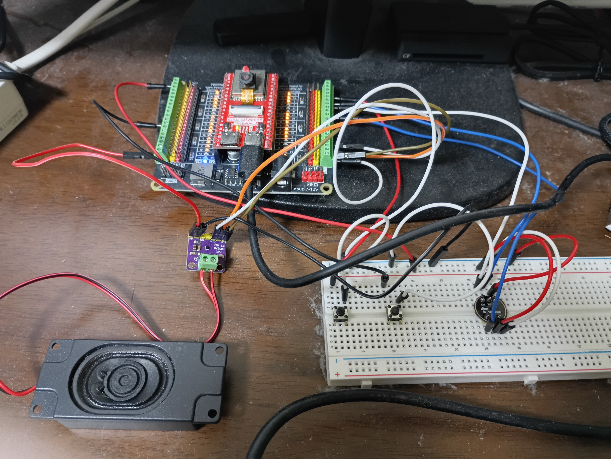
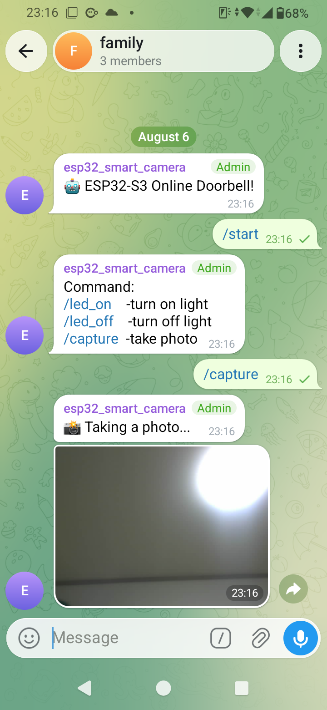
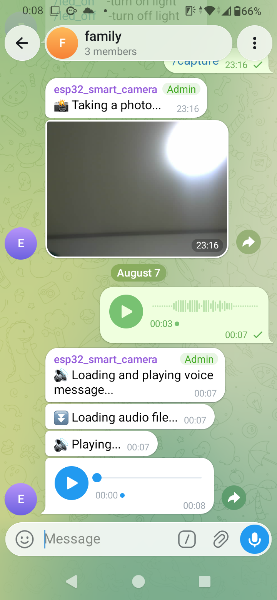

# ESP32-Online-Doorbell
An IoT-based Telegram Smart Doorbell powered by ESP32-S3. Features button notifications with camera snapshot capture and two-way voice message communication via Telegram.

# Project Status
Finished

# Description
**Telegram Smart Doorbell** is an IoT system designed to enhance home security and visitor communication using an **ESP32-S3** board integrated with Telegram.

Whenever a visitor presses the doorbell, the system immediately captures a camera snapshot and sends a push notification with the image directly to a designated Telegram chat/channel. Furthermore, it supports **two-way voice messaging**, allowing you to send and receive voice clips directly between the doorbell unit and your Telegram app.

### Key Highlights:
* 🔔 **Instant Alerts:** Sends a Telegram notification as soon as the doorbell button is pressed.
* 📷 **Image Capture:** Takes a snapshot of the visitor and uploads it to Telegram in real time.
* 🕹️ **Remote Control via Telegram Commands:** Supports interactive chatbot commands (e.g., `/capture` for manual camera snapshots, `/led_on` and `/led_off` to toggle flash/night light).
* 🎙️ **Two-Way Voice Messaging:** 
  * Visitors can record a short voice message to send to Telegram.
  * Homeowners can reply with a voice message from Telegram to be played back at the doorbell.

# Hardware
1) Module FreeNove ESP32-S3 WROOM CAM
2) Module I2S Micro INMP441
3) Module I2S Speaker MAX98357A
4) Speaker 8ohm 3W
5) 2 Push buttons
6) Built-in LED

# Pin Mapping
### I2S Microphone (INMP441)
* **WS (LRCK):** `42`
* **SCK (BCLK):** `41`
* **SD (DOUT):** `38`

### I2S Amplifier (MAX98357A)
* **LRC (LRCK):** `19`
* **BCLK:** `20`
* **DIN:** `47`

### Buttons
* **Doorbell Button:** `1` (Pull-up / Push to GND)
* **Voice Record Button:** `3` (Pull-up / Push to GND)

# How It Works
1. **Visitor Push Button** ➡️ ESP32-S3 captures camera frame ➡️ Sends Photo + Alert to Telegram.
2. **Visitor Voice Record** ➡️ Hold Voice Button ➡️ INMP441 records audio ➡️ ESP32-S3 sends `.ogg` / `.wav` file to Telegram.
3. **Owner Voice Reply** ➡️ Send Voice Message on Telegram ➡️ ESP32-S3 downloads audio ➡️ Playback via MAX98357A + 3W Speaker.

# Software & Dependencies
* **Development Environment:** Arduino IDE
* **Core Board Package:** `ESP32-S3 WROOM CAM` by Freenove
* **Key Libraries:**
  * `WiFiClientSecure.h` (Built-in SSL)
  * `esp_camera.h` (Camera driver)
  * `driver/i2s.h`
  * `UniversalTelegramBot`
  * `ArduinoJson`
  * `LittleFS`
  * `HTTPClient`

# Getting Started

### 1. Telegram Setup
* Create a bot using `@BotFather` to get your `BOT_TOKEN`.
* Get your personal or group Chat ID using `@myidbot`.

### 2. Flashing the Firmware
* Open the project in **Arduino IDE**.
* Select board: **ESP32S3 Dev Module**.
* **PSRAM:** Enabled (`OPI PSRAM`).
* **Partition Scheme:** `Huge APP (3MB No OTA / 1MB SPIFFS)` *(or custom partition for camera/audio)*.
* Upload the code to your board and open the Serial Monitor (115200 baud).

### 3. Provisioning & Configuration (Captive Portal)
This project features a **Web Portal / Access Point (AP)** mode for easy setup without hardcoding credentials in the firmware:

1. **Power on the ESP32-S3:** On first boot (or if saved Wi-Fi is unavailable), the device creates a local Wi-Fi Hotspot (e.g., `ESP32-S3-CAM-Setup`).
2. **Connect to the Hotspot:** Use your smartphone or PC to connect to `ESP32-S3-CAM-Setup`.
3. **Open Config Portal:** A captive portal will open automatically (or navigate to `192.168.4.1` in your browser).
4. **Enter Credentials:**
   * **Wi-Fi SSID & Password**
   * **Telegram Bot Token**
   * **Telegram Chat ID**
5. **Save & Reboot:** Click **Save**. The ESP32-S3 saves parameters to NVS/EEPROM and automatically connects to your Wi-Fi network.

# Screenshots & Demo

| Hardware Assembly | Telegram Chat & Snapshot | Telegram Chat & Snapshot |
| :---: | :---: | :---: |
|  |  | 

> *Left: ESP32-S3 Doorbell unit with INMP441 & MAX98357A. Middle and Right: Telegram instant notification with snapshot and audio message.*

# License
Distributed under the MIT License. See `LICENSE` for more information.

# Author
* **Your Name** - [GitHub Profile](https://github.com/MicaeHoang)
